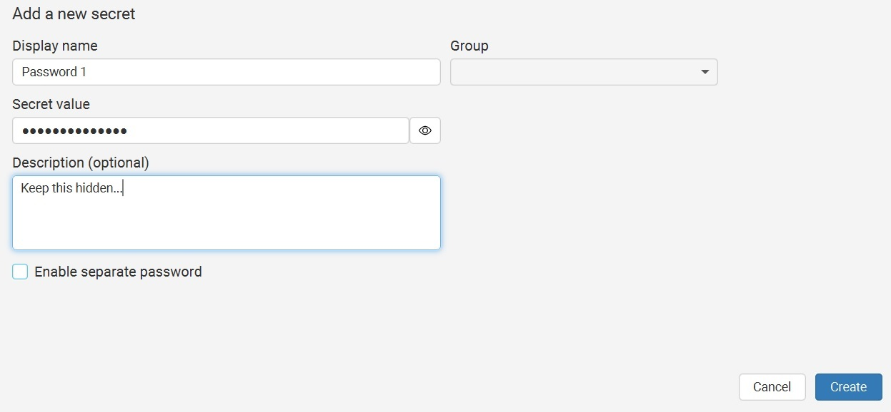
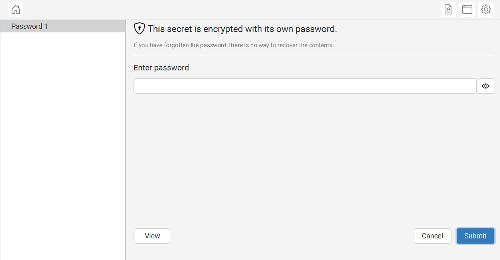
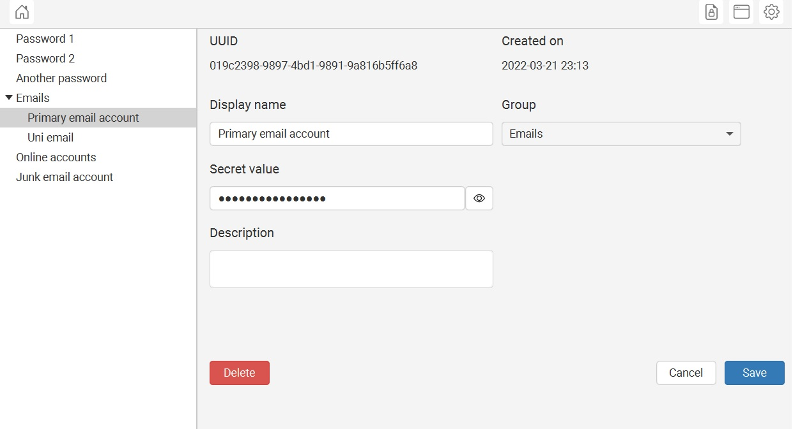

# Keeptio

Keeptio is a little project I've been working on in my spare time. Always been interested in encryption software, especially password managers, so I wanted to try making one in JavaFX. Still a work in progress and not the best code design either. 

## Current features

- Creating vaults (password, encryption settings)
- CRUD operations on secrets
- Secrets can have their own passwords within the vault
- Creating groups to categorise secrets
- Moving secrets between groups

## Future features

- Backing up vaults and vault changes to cloud storage (can see some of it already in Vault Settings)
- Changing vault password and encryption settings
- CRUD operations on groups
- and more...

## Demo

